# **UBUNTU GROWTHOS — DATA ARCHITECTURE & ENTITY RELATIONSHIP MODEL (ERM v1.0)**

## **Document Control**

| Field | Value |
| --- | --- |
| **Version** | 1.0 |
| **Status** | Draft — Foundation for PRD |
| **Prepared For** | Chimezie Chuta, Commercial Director of Sales & Partnerships |
| **Platform** | Ubuntu GrowthOS (Commercial Intelligence & Growth Operations Platform) |
| **Upstream Sources** | Source PDFs (Source Documents Index), Ubuntu Tribe Knowledge Base v1.0, Commercial Operating Model (COM v1.0), Functional Specification Blueprint (FSB v1.0) |
| **Downstream Consumers** | Product Requirements Document (PRD), Technical Architecture, API Design, Database Schema |
| **Source of Truth** | `UBUNTU GROWTHOS SOURCE DOCUMENTS INDEX.md` |

---

## **1. Purpose & Scope**

This document defines the **logical data architecture** and **entity relationship model** for Ubuntu GrowthOS — the internal platform that will replace fragmented spreadsheets and Notion pages with a single source of truth for commercial operations.

### **1.1 Objectives**

1. Establish a shared vocabulary for all commercial, sovereign, institutional, and capital-formation data.
2. Define entities, attributes, relationships, and lifecycle states before PRD and implementation.
3. Map Ubuntu Tribe's commercial operating model (COM v1.0) and B2G workflow into a structured, queryable data model.
4. Support phased delivery (FSB Phases 1–4) without requiring schema rewrites between phases.

### **1.2 In Scope**

- Commercial CRM (government, institutional, partner, retail-adjacent accounts)
- Deal pipeline and revenue forecasting
- Legal document lifecycle (NDA → MOU → Contract)
- Events, conferences, and engagement tracking
- Tokenization project registry
- Capital formation and investor relations
- Compliance and due diligence
- Knowledge management metadata
- Executive reporting dimensions

### **1.3 Out of Scope (v1.0)**

- On-chain transaction data (wallet balances, token minting events) — referenced via external IDs only
- Full document binary storage schema (handled by object storage; this model stores metadata and references)
- Marketing automation execution engines
- HR / internal employee management beyond platform user accounts

---

## **2. Data Architecture Principles**

| Principle | Description |
| --- | --- |
| **Single Source of Truth** | Every government, account, deal, contract, and project exists once; modules reference shared core entities. |
| **Segment-Aware Design** | Entities carry `segment` and `customer_type` dimensions aligned to COM v1.0 (B2G, B2B, B2C, Institutional, Ecosystem Partner). |
| **Lifecycle-First** | Deals, documents, projects, and partnerships have explicit stage/status enums traceable to COM commercial lifecycle. |
| **Polymorphic Organization Model** | Governments, institutional accounts, partners, and investors share a common `Organization` super-entity with type-specific extensions. |
| **Auditability** | All core entities support `created_at`, `updated_at`, `created_by`, and soft-delete where appropriate. |
| **Extensibility** | Custom fields via `metadata` JSONB on key entities for market-specific attributes without schema churn. |
| **Phase-Ready** | Phase 1 entities (Government CRM, Accounts, Pipeline) are fully defined; Phase 2–4 entities are modeled but may ship with reduced UI. |

---

## **3. Architecture Overview**

### **3.1 Domain Map**

Ubuntu GrowthOS data is organized into **nine logical domains**:

```
┌─────────────────────────────────────────────────────────────────────────────┐
│                        EXECUTIVE & ANALYTICS LAYER                          │
│         (Dashboards, Forecasts, KPIs — derived from domain data)            │
└─────────────────────────────────────────────────────────────────────────────┘
                                      ▲
┌──────────────┬──────────────┬───────────────┬──────────────┬────────────────┐
│   CORE CRM   │   PIPELINE   │   DOCUMENTS   │    EVENTS    │  KNOWLEDGE     │
│ Organizations│    Deals     │  Contracts    │ Conferences  │  Vault Assets  │
│  Contacts    │  Forecasts   │  NDAs/MOUs    │  Meetings    │  Templates     │
│  Stakeholders│  Activities  │  Proposals    │  Leads       │  Research      │
└──────────────┴──────────────┴───────────────┴──────────────┴────────────────┘
                                      ▲
┌──────────────┬──────────────┬───────────────┬──────────────┬────────────────┐
│ TOKENIZATION │    CAPITAL   │  COMPLIANCE   │  PARTNERSHIP │   PLATFORM     │
│   Projects   │   Formation  │  Due Diligence│  Alliances   │   Users/Roles  │
│   Resources  │   Investors  │  KYC Records  │  Agreements  │   Territories│
└──────────────┴──────────────┴───────────────┴──────────────┴────────────────┘
```

### **3.2 Entity Count Summary**

| Domain | Primary Entities | Phase |
| --- | --- | --- |
| Platform | User, Role, Territory, Product | 1 |
| Core CRM | Organization, GovernmentProfile, AccountProfile, PartnerProfile, Contact, StakeholderMap | 1 |
| Pipeline | Deal, DealStageHistory, Activity, Task, Note, Forecast | 1 |
| Documents | Document, DocumentVersion, ApprovalRequest | 2 |
| Events | Event, EventParticipant, EventLead | 2 |
| Knowledge | KnowledgeAsset, KnowledgeTag | 2 |
| Tokenization | TokenizationProject, ResourceAsset, ProjectPhase | 3 |
| Capital | InvestorProfile, CapitalRaise, InvestmentCommitment | 3 |
| Compliance | ComplianceCase, DueDiligenceCheck, KYCRecord | 3 |
| Partnership | Partnership, PartnershipAgreement | 1–2 |
| Revenue | RevenueRecord, TreasuryConversion | 2–3 |

---

## **4. Enumerations & Reference Data**

These controlled vocabularies are shared across entities.

### **4.1 Customer Segment**

| Code | Label | Description |
| --- | --- | --- |
| `B2G` | Sovereign & Government | National/state governments, ministries, agencies |
| `B2B` | Institutional & Enterprise | Banks, PSPs, exchanges, mining, treasuries |
| `B2C` | Retail | Retail investors, gold savers (tracked at aggregate/partner level in GrowthOS) |
| `INSTITUTIONAL` | Institutional Capital | VCs, family offices, asset managers, SWFs |
| `ECOSYSTEM` | Strategic Ecosystem Partner | Foundations, custodians, auditors, listing partners |

### **4.2 Revenue Engine**

| Code | Label |
| --- | --- |
| `GIFT_ADOPTION` | GIFT Adoption |
| `TOKENIZATION_TaaS` | Tokenization-as-a-Service |
| `CAPITAL_FORMATION` | Capital Formation |
| `STRATEGIC_PARTNERSHIP` | Strategic Partnerships |
| `FINANCIAL_INFRASTRUCTURE` | Financial Infrastructure (Wallet, Settlement) |

### **4.3 Deal Stage (Pipeline)**

Aligned to COM v1.0 commercial lifecycle:

| Order | Stage Code | Label |
| --- | --- | --- |
| 1 | `LEAD` | Lead |
| 2 | `QUALIFIED` | Qualified |
| 3 | `DISCOVERY` | Discovery |
| 4 | `STAKEHOLDER_MAPPING` | Stakeholder Mapping |
| 5 | `NDA` | NDA |
| 6 | `PROPOSAL` | Proposal |
| 7 | `MOU` | MOU |
| 8 | `NEGOTIATION` | Commercial Negotiation |
| 9 | `CONTRACT` | Contract |
| 10 | `WON` | Won |
| 11 | `IMPLEMENTATION` | Implementation |
| 12 | `REVENUE_REALIZATION` | Revenue Realization |
| 13 | `EXPANSION` | Account Expansion |
| 14 | `LOST` | Lost |
| 15 | `ON_HOLD` | On Hold |

### **4.4 Document Type**

| Code | Label |
| --- | --- |
| `NDA` | Non-Disclosure Agreement |
| `MOU` | Memorandum of Understanding |
| `PROPOSAL` | Commercial Proposal |
| `GOVERNMENT_BRIEF` | Government Brief |
| `PARTNERSHIP_AGREEMENT` | Partnership Agreement |
| `INVESTOR_DECK` | Investor Deck |
| `CONTRACT` | Executed Contract |
| `SOW` | Statement of Work |
| `OTHER` | Other |

### **4.5 Document Status**

`DRAFT` → `IN_REVIEW` → `PENDING_APPROVAL` → `APPROVED` → `SENT` → `SIGNED` → `EXECUTED` → `EXPIRED` → `TERMINATED`

### **4.6 Event Type**

`CONFERENCE`, `ROUNDTABLE`, `EXECUTIVE_MEETING`, `GOVERNMENT_BRIEFING`, `WORKSHOP`, `WEBINAR`, `INTERNAL`, `OTHER`

### **4.7 Tokenization Asset Type**

`GOLD`, `SILVER`, `LITHIUM`, `COPPER`, `RARE_EARTH`, `REAL_ESTATE`, `INFRASTRUCTURE`, `CARBON`, `COMMUNITY_DEVELOPMENT`, `OTHER`

### **4.8 B2G Project Phase (Tokenization Workflow)**

From Knowledge Base Part III:

| Order | Phase Code | Label |
| --- | --- | --- |
| 1 | `RESOURCE_DISCOVERY` | Resource Discovery |
| 2 | `RESOURCE_VALUATION` | Resource Valuation |
| 3 | `DIGITAL_ASSET_STRUCTURING` | Digital Asset Structuring |
| 4 | `CAPITAL_FORMATION` | Capital Formation |
| 5 | `DEVELOPMENT_DEPLOYMENT` | Development & Deployment |

### **4.9 Product (Ubuntu Ecosystem)**

| Code | Label |
| --- | --- |
| `GIFT` | GIFT (Gold International Fungible Token) |
| `UTRIBE_WALLET` | UTribe Wallet |
| `UBUNTUVERSE` | UbuntuVerse (Tokenization-as-a-Service) |
| `UBUNTU_CAPITAL` | Ubuntu Capital |

### **4.10 User Role**

`EXECUTIVE`, `COMMERCIAL`, `LEGAL`, `MARKETING`, `OPERATIONS`, `ADMIN`

### **4.11 Compliance Status**

`NOT_STARTED`, `IN_PROGRESS`, `PENDING_REVIEW`, `CLEARED`, `FLAGGED`, `BLOCKED`

### **4.12 Partnership Type**

`DISTRIBUTION`, `STRATEGIC_ALLIANCE`, `JOINT_VENTURE`, `TECHNOLOGY`, `LISTING`, `CUSTODY`, `REVENUE_SHARE`, `REFERRAL`, `OTHER`

---

## **5. Core Entity Definitions**

Each entity includes: **Purpose**, **Key Attributes**, **Constraints**, and **Relationships**.

Primary keys use UUID (`id`). Foreign keys follow `{entity}_id` naming.

---

### **5.1 PLATFORM DOMAIN**

#### **5.1.1 User**

Platform operator with role-based access.

| Attribute | Type | Required | Description |
| --- | --- | --- | --- |
| `id` | UUID | Yes | Primary key |
| `email` | String | Yes | Unique login identifier |
| `full_name` | String | Yes | Display name |
| `role` | Enum (UserRole) | Yes | Primary role |
| `title` | String | No | Job title |
| `department` | String | No | e.g., Commercial, Legal |
| `reports_to_id` | UUID (FK → User) | No | Reporting hierarchy |
| `territory_ids` | UUID[] | No | Assigned markets |
| `is_active` | Boolean | Yes | Account status |
| `last_login_at` | Timestamp | No | Audit |

**Relationships:** Owns Deals (owner), Activities, Tasks, Approvals.

---

#### **5.1.2 Territory**

Geographic or strategic market unit.

| Attribute | Type | Required | Description |
| --- | --- | --- | --- |
| `id` | UUID | Yes | Primary key |
| `name` | String | Yes | e.g., Nigeria, West Africa, Global |
| `region` | String | No | Continent/region grouping |
| `country_code` | ISO 3166-1 alpha-2 | No | Country if applicable |
| `priority` | Enum | No | `HIGH`, `MEDIUM`, `LOW` |
| `is_active` | Boolean | Yes | |

**Relationships:** Organizations, Deals, Events may be scoped to Territory.

---

#### **5.1.3 Product**

Ubuntu ecosystem product or service line.

| Attribute | Type | Required | Description |
| --- | --- | --- | --- |
| `id` | UUID | Yes | Primary key |
| `code` | Enum (Product) | Yes | Unique product code |
| `name` | String | Yes | Display name |
| `description` | Text | No | |
| `revenue_engine` | Enum (RevenueEngine) | Yes | Primary revenue classification |
| `is_active` | Boolean | Yes | |

**Relationships:** Deals, RevenueRecords reference Product.

---

### **5.2 CORE CRM DOMAIN**

#### **5.2.1 Organization** *(Super-Entity)*

Unified record for any external party: government body, institution, partner, or investor.

| Attribute | Type | Required | Description |
| --- | --- | --- | --- |
| `id` | UUID | Yes | Primary key |
| `name` | String | Yes | Legal or commonly used name |
| `legal_name` | String | No | Registered legal entity name |
| `organization_type` | Enum | Yes | `GOVERNMENT`, `INSTITUTIONAL`, `PARTNER`, `INVESTOR`, `OTHER` |
| `segment` | Enum (CustomerSegment) | Yes | B2G, B2B, etc. |
| `website` | URL | No | |
| `headquarters_country` | String | No | ISO country code |
| `headquarters_city` | String | No | |
| `territory_id` | UUID (FK → Territory) | No | Primary market |
| `owner_id` | UUID (FK → User) | Yes | Commercial owner |
| `status` | Enum | Yes | `PROSPECT`, `ACTIVE`, `DORMANT`, `CHURNED` |
| `tier` | Enum | No | `STRATEGIC`, `TIER_1`, `TIER_2`, `TIER_3` |
| `description` | Text | No | Summary profile |
| `metadata` | JSONB | No | Extensible attributes |
| `created_at` / `updated_at` | Timestamp | Yes | Audit |

**Constraints:** `name` + `organization_type` should be unique within territory (soft uniqueness).

**Relationships:**
- 1:1 → GovernmentProfile | AccountProfile | PartnerProfile | InvestorProfile (by type)
- 1:N → Contact, Deal, Activity, Document, EventParticipant, ComplianceCase
- N:M → Partnership (via PartnershipMember)

---

#### **5.2.2 GovernmentProfile**

Extension for sovereign and government entities (Module 1).

| Attribute | Type | Required | Description |
| --- | --- | --- | --- |
| `id` | UUID | Yes | Primary key |
| `organization_id` | UUID (FK → Organization) | Yes | Unique — 1:1 |
| `government_level` | Enum | Yes | `NATIONAL`, `STATE`, `REGIONAL`, `LOCAL`, `SOVEREIGN_INSTITUTION`, `TRADITIONAL_KINGDOM` |
| `entity_subtype` | Enum | No | `MINISTRY`, `AGENCY`, `REGULATORY_BODY`, `DEVELOPMENT_AUTHORITY`, `SOVEREIGN_WEALTH_FUND` |
| `jurisdiction` | String | No | Country or state |
| `parent_government_id` | UUID (FK → Organization) | No | e.g., Ministry under National Govt |
| `resource_endowment` | Text | No | Known natural resources |
| `political_stability_score` | Integer (1–5) | No | Internal assessment |
| `engagement_priority` | Enum | No | `CRITICAL`, `HIGH`, `MEDIUM`, `LOW` |
| `regulatory_environment_notes` | Text | No | |

**Relationships:** Parent/child government hierarchy; links to TokenizationProjects in jurisdiction.

---

#### **5.2.3 AccountProfile**

Extension for institutional and enterprise B2B accounts (Module 2).

| Attribute | Type | Required | Description |
| --- | --- | --- | --- |
| `id` | UUID | Yes | Primary key |
| `organization_id` | UUID (FK → Organization) | Yes | Unique — 1:1 |
| `account_subtype` | Enum | Yes | `BANK`, `FINTECH`, `PSP`, `EXCHANGE`, `OTC_DESK`, `MINING`, `COMMODITY_TRADER`, `FAMILY_OFFICE`, `ASSET_MANAGER`, `CORPORATE_TREASURY`, `OTHER` |
| `aum_range` | String | No | Assets under management band |
| `treasury_interest_level` | Enum | No | `NONE`, `EXPLORING`, `ACTIVE`, `COMMITTED` |
| `gift_adoption_status` | Enum | No | `NONE`, `EVALUATING`, `PILOT`, `LIVE` |
| `wallet_integration_status` | Enum | No | `NONE`, `IN_PROGRESS`, `LIVE` |
| `annual_revenue_potential` | Decimal | No | Estimated USD |
| `decision_cycle_months` | Integer | No | Typical sales cycle |

---

#### **5.2.4 PartnerProfile**

Extension for strategic ecosystem partners (COM Segment C).

| Attribute | Type | Required | Description |
| --- | --- | --- | --- |
| `id` | UUID | Yes | Primary key |
| `organization_id` | UUID (FK → Organization) | Yes | Unique — 1:1 |
| `partner_subtype` | Enum | No | `BLOCKCHAIN_FOUNDATION`, `INDUSTRY_ASSOCIATION`, `TECH_PROVIDER`, `CUSTODIAN`, `AUDITOR`, `LISTING_PARTNER`, `VENTURE_NETWORK` |
| `partnership_type` | Enum (PartnershipType) | No | Primary partnership classification |
| `distribution_reach` | Text | No | Markets/channels covered |
| `strategic_value_score` | Integer (1–100) | No | Internal scoring |

---

#### **5.2.5 InvestorProfile**

Extension for institutional capital (Module 7).

| Attribute | Type | Required | Description |
| --- | --- | --- | --- |
| `id` | UUID | Yes | Primary key |
| `organization_id` | UUID (FK → Organization) | Yes | Unique — 1:1 |
| `investor_type` | Enum | Yes | `VC`, `FAMILY_OFFICE`, `INSTITUTIONAL`, `SOVEREIGN_WEALTH`, `TREASURY`, `ASSET_MANAGER`, `ANGEL`, `OTHER` |
| `investment_thesis` | Text | No | Focus areas |
| `typical_check_size_min` | Decimal | No | USD |
| `typical_check_size_max` | Decimal | No | USD |
| `preferred_asset_classes` | String[] | No | e.g., RWA, Gold, Infrastructure |
| `relationship_warmth` | Enum | No | `COLD`, `WARM`, `HOT`, `LP` |

---

#### **5.2.6 Contact**

Individual person associated with an Organization.

| Attribute | Type | Required | Description |
| --- | --- | --- | --- |
| `id` | UUID | Yes | Primary key |
| `organization_id` | UUID (FK → Organization) | Yes | |
| `first_name` | String | Yes | |
| `last_name` | String | Yes | |
| `title` | String | No | Job title |
| `department` | String | No | e.g., Ministry of Finance |
| `email` | String | No | |
| `phone` | String | No | |
| `linkedin_url` | URL | No | |
| `contact_role` | Enum | No | `DECISION_MAKER`, `INFLUENCER`, `CHAMPION`, `GATEKEEPER`, `LEGAL`, `TECHNICAL`, `OTHER` |
| `influence_level` | Enum | No | `HIGH`, `MEDIUM`, `LOW` |
| `is_primary` | Boolean | No | Primary contact flag |
| `notes` | Text | No | |

**Relationships:** StakeholderMap entries, EventParticipant, Activity attendees.

---

#### **5.2.7 StakeholderMap**

Maps influence relationships within an account or government engagement.

| Attribute | Type | Required | Description |
| --- | --- | --- | --- |
| `id` | UUID | Yes | Primary key |
| `deal_id` | UUID (FK → Deal) | No | Scoped to a deal if applicable |
| `organization_id` | UUID (FK → Organization) | Yes | |
| `contact_id` | UUID (FK → Contact) | Yes | |
| `relationship_to_ubuntu` | Enum | No | `CHAMPION`, `SUPPORTER`, `NEUTRAL`, `SKEPTIC`, `BLOCKER` |
| `relationship_to_decision` | Text | No | Narrative context |
| `reports_to_contact_id` | UUID (FK → Contact) | No | Org chart link |
| `engagement_score` | Integer (1–100) | No | |

---

### **5.3 PIPELINE DOMAIN**

#### **5.3.1 Deal**

Central opportunity record spanning all segments and revenue engines (Module 3).

| Attribute | Type | Required | Description |
| --- | --- | --- | --- |
| `id` | UUID | Yes | Primary key |
| `name` | String | Yes | Opportunity title |
| `organization_id` | UUID (FK → Organization) | Yes | Primary account |
| `owner_id` | UUID (FK → User) | Yes | Deal owner |
| `segment` | Enum (CustomerSegment) | Yes | |
| `revenue_engine` | Enum (RevenueEngine) | Yes | |
| `product_id` | UUID (FK → Product) | No | Primary product |
| `stage` | Enum (DealStage) | Yes | Current pipeline stage |
| `probability` | Decimal (0–100) | No | Win probability % |
| `estimated_value` | Decimal | No | USD pipeline value |
| `weighted_value` | Decimal | Computed | `estimated_value × probability` |
| `currency` | String | Yes | Default `USD` |
| `expected_close_date` | Date | No | |
| `actual_close_date` | Date | No | |
| `source` | Enum | No | `INBOUND`, `OUTBOUND`, `EVENT`, `REFERRAL`, `PARTNER`, `GOVERNMENT`, `OTHER` |
| `source_event_id` | UUID (FK → Event) | No | Lead attribution |
| `source_partner_id` | UUID (FK → Organization) | No | Referring partner |
| `tokenization_project_id` | UUID (FK → TokenizationProject) | No | Linked tokenization opp |
| `capital_raise_id` | UUID (FK → CapitalRaise) | No | Linked capital raise |
| `partnership_id` | UUID (FK → Partnership) | No | Linked partnership |
| `priority` | Enum | No | `CRITICAL`, `HIGH`, `MEDIUM`, `LOW` |
| `loss_reason` | Text | No | If stage = LOST |
| `next_step` | Text | No | |
| `next_step_date` | Date | No | |
| `description` | Text | No | |
| `metadata` | JSONB | No | |

**Relationships:** DealStageHistory, Document, Activity, Task, Forecast, StakeholderMap, RevenueRecord.

---

#### **5.3.2 DealStageHistory**

Immutable audit trail of stage transitions.

| Attribute | Type | Required | Description |
| --- | --- | --- | --- |
| `id` | UUID | Yes | Primary key |
| `deal_id` | UUID (FK → Deal) | Yes | |
| `from_stage` | Enum (DealStage) | No | Null on creation |
| `to_stage` | Enum (DealStage) | Yes | |
| `changed_by_id` | UUID (FK → User) | Yes | |
| `changed_at` | Timestamp | Yes | |
| `duration_in_previous_stage_days` | Integer | Computed | |
| `notes` | Text | No | |

---

#### **5.3.3 Activity**

Logged interaction (call, meeting, email, visit).

| Attribute | Type | Required | Description |
| --- | --- | --- | --- |
| `id` | UUID | Yes | Primary key |
| `activity_type` | Enum | Yes | `CALL`, `MEETING`, `EMAIL`, `SITE_VISIT`, `DEMO`, `PRESENTATION`, `OTHER` |
| `subject` | String | Yes | |
| `description` | Text | No | |
| `occurred_at` | Timestamp | Yes | |
| `duration_minutes` | Integer | No | |
| `organization_id` | UUID (FK → Organization) | No | |
| `deal_id` | UUID (FK → Deal) | No | |
| `event_id` | UUID (FK → Event) | No | |
| `logged_by_id` | UUID (FK → User) | Yes | |
| `outcome` | Text | No | |
| `follow_up_required` | Boolean | No | |

**Relationships:** N:M with Contact via `ActivityContact` junction.

---

#### **5.3.4 Task**

Action item with assignee and due date.

| Attribute | Type | Required | Description |
| --- | --- | --- | --- |
| `id` | UUID | Yes | Primary key |
| `title` | String | Yes | |
| `description` | Text | No | |
| `assignee_id` | UUID (FK → User) | Yes | |
| `due_date` | Date | No | |
| `status` | Enum | Yes | `OPEN`, `IN_PROGRESS`, `COMPLETED`, `CANCELLED` |
| `priority` | Enum | No | |
| `deal_id` | UUID (FK → Deal) | No | |
| `organization_id` | UUID (FK → Organization) | No | |

---

#### **5.3.5 Note**

Free-form notes attachable to any core entity.

| Attribute | Type | Required | Description |
| --- | --- | --- | --- |
| `id` | UUID | Yes | Primary key |
| `body` | Text | Yes | |
| `author_id` | UUID (FK → User) | Yes | |
| `entity_type` | String | Yes | Polymorphic: `Deal`, `Organization`, etc. |
| `entity_id` | UUID | Yes | Polymorphic FK |
| `is_pinned` | Boolean | No | |

---

#### **5.3.6 Forecast**

Period-based revenue forecast rollup.

| Attribute | Type | Required | Description |
| --- | --- | --- | --- |
| `id` | UUID | Yes | Primary key |
| `period_type` | Enum | Yes | `WEEKLY`, `MONTHLY`, `QUARTERLY`, `ANNUAL` |
| `period_start` | Date | Yes | |
| `period_end` | Date | Yes | |
| `segment` | Enum (CustomerSegment) | No | Optional filter |
| `revenue_engine` | Enum (RevenueEngine) | No | Optional filter |
| `forecast_amount` | Decimal | Yes | USD |
| `commit_amount` | Decimal | No | High-confidence subset |
| `best_case_amount` | Decimal | No | |
| `submitted_by_id` | UUID (FK → User) | Yes | |
| `submitted_at` | Timestamp | Yes | |
| `notes` | Text | No | |

**Relationships:** ForecastLineItem (optional breakdown by Deal).

---

### **5.4 DOCUMENT DOMAIN**

#### **5.4.1 Document**

Commercial and legal document metadata (Module 4).

| Attribute | Type | Required | Description |
| --- | --- | --- | --- |
| `id` | UUID | Yes | Primary key |
| `title` | String | Yes | |
| `document_type` | Enum (DocumentType) | Yes | |
| `status` | Enum (DocumentStatus) | Yes | |
| `organization_id` | UUID (FK → Organization) | No | Counterparty |
| `deal_id` | UUID (FK → Deal) | No | |
| `partnership_id` | UUID (FK → Partnership) | No | |
| `current_version_id` | UUID (FK → DocumentVersion) | No | |
| `owner_id` | UUID (FK → User) | Yes | |
| `effective_date` | Date | No | |
| `expiration_date` | Date | No | |
| `signed_date` | Date | No | |
| `external_storage_url` | URL | No | S3/GDrive reference |
| `ai_generated` | Boolean | No | Flag for AI-drafted docs |

**Relationships:** DocumentVersion (1:N), ApprovalRequest.

---

#### **5.4.2 DocumentVersion**

Version-controlled document content reference.

| Attribute | Type | Required | Description |
| --- | --- | --- | --- |
| `id` | UUID | Yes | Primary key |
| `document_id` | UUID (FK → Document) | Yes | |
| `version_number` | Integer | Yes | Sequential per document |
| `storage_url` | URL | Yes | File location |
| `file_hash` | String | No | Integrity check |
| `change_summary` | Text | No | |
| `created_by_id` | UUID (FK → User) | Yes | |
| `created_at` | Timestamp | Yes | |

---

#### **5.4.3 ApprovalRequest**

Legal/executive approval workflow.

| Attribute | Type | Required | Description |
| --- | --- | --- | --- |
| `id` | UUID | Yes | Primary key |
| `document_id` | UUID (FK → Document) | Yes | |
| `requested_by_id` | UUID (FK → User) | Yes | |
| `approver_id` | UUID (FK → User) | Yes | |
| `status` | Enum | Yes | `PENDING`, `APPROVED`, `REJECTED`, `CANCELLED` |
| `requested_at` | Timestamp | Yes | |
| `resolved_at` | Timestamp | No | |
| `comments` | Text | No | |

---

#### **5.4.4 Contract**

Specialized view/extension of executed Document (may be implemented as Document with `document_type = CONTRACT` plus extension table).

| Attribute | Type | Required | Description |
| --- | --- | --- | --- |
| `id` | UUID | Yes | Primary key |
| `document_id` | UUID (FK → Document) | Yes | Unique — 1:1 with executed doc |
| `contract_number` | String | Yes | Internal reference |
| `contract_value` | Decimal | No | Total contract USD |
| `payment_terms` | Text | No | |
| `renewal_date` | Date | No | |
| `auto_renew` | Boolean | No | |
| `termination_clause_summary` | Text | No | |
| `governing_law` | String | No | Jurisdiction |

---

### **5.5 EVENT DOMAIN**

#### **5.5.1 Event**

Conferences, roundtables, briefings, and external engagements (Module 5).

| Attribute | Type | Required | Description |
| --- | --- | --- | --- |
| `id` | UUID | Yes | Primary key |
| `name` | String | Yes | |
| `event_type` | Enum (EventType) | Yes | |
| `start_date` | Date | Yes | |
| `end_date` | Date | No | |
| `location` | String | No | City, venue, or virtual |
| `country_code` | String | No | |
| `territory_id` | UUID (FK → Territory) | No | |
| `description` | Text | No | |
| `budget` | Decimal | No | USD spend |
| `actual_cost` | Decimal | No | |
| `ubuntu_role` | Enum | No | `SPEAKER`, `SPONSOR`, `EXHIBITOR`, `ATTENDEE`, `HOST` |
| `owner_id` | UUID (FK → User) | Yes | |
| `roi_notes` | Text | No | Post-event assessment |
| `leads_generated_count` | Integer | Computed | From EventLead |

---

#### **5.5.2 EventParticipant**

Ubuntu or external participation record.

| Attribute | Type | Required | Description |
| --- | --- | --- | --- |
| `id` | UUID | Yes | Primary key |
| `event_id` | UUID (FK → Event) | Yes | |
| `participant_type` | Enum | Yes | `UBUNTU_USER`, `CONTACT`, `ORGANIZATION` |
| `user_id` | UUID (FK → User) | No | If Ubuntu attendee |
| `contact_id` | UUID (FK → Contact) | No | If external |
| `organization_id` | UUID (FK → Organization) | No | |
| `role_at_event` | String | No | Speaker, panelist, etc. |

---

#### **5.5.3 EventLead**

Lead captured at an event, linked to pipeline.

| Attribute | Type | Required | Description |
| --- | --- | --- | --- |
| `id` | UUID | Yes | Primary key |
| `event_id` | UUID (FK → Event) | Yes | |
| `contact_id` | UUID (FK → Contact) | No | |
| `organization_id` | UUID (FK → Organization) | No | |
| `deal_id` | UUID (FK → Deal) | No | Created deal if converted |
| `lead_quality` | Enum | No | `HOT`, `WARM`, `COLD` |
| `follow_up_status` | Enum | No | `PENDING`, `CONTACTED`, `CONVERTED`, `DISCARDED` |
| `notes` | Text | No | |

---

### **5.6 TOKENIZATION DOMAIN**

#### **5.6.1 TokenizationProject**

Asset tokenization opportunity registry (Module 6).

| Attribute | Type | Required | Description |
| --- | --- | --- | --- |
| `id` | UUID | Yes | Primary key |
| `name` | String | Yes | Project name |
| `organization_id` | UUID (FK → Organization) | Yes | Government or asset owner |
| `government_profile_id` | UUID (FK → GovernmentProfile) | No | If B2G |
| `asset_type` | Enum (TokenizationAssetType) | Yes | |
| `current_phase` | Enum (B2GProjectPhase) | Yes | B2G workflow phase |
| `estimated_asset_value` | Decimal | No | USD |
| `tokenization_readiness_score` | Integer (1–100) | No | |
| `opportunity_score` | Integer (1–100) | No | Commercial priority |
| `jurisdiction` | String | No | Legal jurisdiction |
| `status` | Enum | Yes | `PROSPECT`, `ACTIVE`, `STRUCTURING`, `LIVE`, `PAUSED`, `COMPLETED` |
| `owner_id` | UUID (FK → User) | Yes | |
| `description` | Text | No | |
| `deal_id` | UUID (FK → Deal) | No | Primary commercial deal |

---

#### **5.6.2 ResourceAsset**

Specific resource within a tokenization project.

| Attribute | Type | Required | Description |
| --- | --- | --- | --- |
| `id` | UUID | Yes | Primary key |
| `tokenization_project_id` | UUID (FK → TokenizationProject) | Yes | |
| `asset_name` | String | Yes | e.g., "Lithium Deposit — Region X" |
| `asset_type` | Enum (TokenizationAssetType) | Yes | |
| `estimated_reserves` | String | No | Quantity/description |
| `valuation_amount` | Decimal | No | USD |
| `valuation_date` | Date | No | |
| `valuation_source` | String | No | |
| `location` | String | No | Geographic |
| `discovery_status` | Enum | No | `IDENTIFIED`, `MAPPED`, `ASSESSED`, `VERIFIED` |

---

#### **5.6.3 ProjectPhaseHistory**

Tracks progression through B2G tokenization workflow phases.

| Attribute | Type | Required | Description |
| --- | --- | --- | --- |
| `id` | UUID | Yes | Primary key |
| `tokenization_project_id` | UUID (FK → TokenizationProject) | Yes | |
| `phase` | Enum (B2GProjectPhase) | Yes | |
| `entered_at` | Timestamp | Yes | |
| `completed_at` | Timestamp | No | |
| `outcome_summary` | Text | No | |

---

### **5.7 CAPITAL FORMATION DOMAIN**

#### **5.7.1 CapitalRaise**

Funding initiative linked to projects or ecosystem (Module 7).

| Attribute | Type | Required | Description |
| --- | --- | --- | --- |
| `id` | UUID | Yes | Primary key |
| `name` | String | Yes | |
| `organization_id` | UUID (FK → Organization) | No | Issuer / beneficiary |
| `tokenization_project_id` | UUID (FK → TokenizationProject) | No | |
| `deal_id` | UUID (FK → Deal) | No | |
| `target_amount` | Decimal | Yes | USD |
| `raised_amount` | Decimal | No | USD to date |
| `currency` | String | Yes | |
| `raise_type` | Enum | No | `EQUITY`, `DEBT`, `TOKEN_SALE`, `HYBRID`, `ADVISORY` |
| `status` | Enum | Yes | `PLANNED`, `ACTIVE`, `CLOSED`, `CANCELLED` |
| `open_date` | Date | No | |
| `close_date` | Date | No | |
| `owner_id` | UUID (FK → User) | Yes | |

---

#### **5.7.2 InvestmentCommitment**

Investor commitment to a capital raise.

| Attribute | Type | Required | Description |
| --- | --- | --- | --- |
| `id` | UUID | Yes | Primary key |
| `capital_raise_id` | UUID (FK → CapitalRaise) | Yes | |
| `investor_profile_id` | UUID (FK → InvestorProfile) | Yes | |
| `committed_amount` | Decimal | Yes | USD |
| `status` | Enum | Yes | `INTEREST`, `SOFT_COMMIT`, `HARD_COMMIT`, `FUNDED`, `WITHDRAWN` |
| `commitment_date` | Date | No | |
| `notes` | Text | No | |

---

### **5.8 COMPLIANCE DOMAIN**

#### **5.8.1 ComplianceCase**

Master compliance record per organization or deal (Module 8).

| Attribute | Type | Required | Description |
| --- | --- | --- | --- |
| `id` | UUID | Yes | Primary key |
| `organization_id` | UUID (FK → Organization) | No | |
| `deal_id` | UUID (FK → Deal) | No | |
| `case_type` | Enum | Yes | `KYC`, `DUE_DILIGENCE`, `REGULATORY`, `COUNTERPARTY` |
| `status` | Enum (ComplianceStatus) | Yes | |
| `assigned_to_id` | UUID (FK → User) | No | |
| `due_date` | Date | No | |
| `cleared_at` | Timestamp | No | |
| `risk_level` | Enum | No | `LOW`, `MEDIUM`, `HIGH`, `CRITICAL` |
| `summary` | Text | No | |

---

#### **5.8.2 DueDiligenceCheck**

Individual checklist item within a compliance case.

| Attribute | Type | Required | Description |
| --- | --- | --- | --- |
| `id` | UUID | Yes | Primary key |
| `compliance_case_id` | UUID (FK → ComplianceCase) | Yes | |
| `check_name` | String | Yes | e.g., "Beneficial Ownership Verification" |
| `check_category` | Enum | No | `LEGAL`, `FINANCIAL`, `REGULATORY`, `REPUTATIONAL`, `TECHNICAL` |
| `status` | Enum (ComplianceStatus) | Yes | |
| `completed_at` | Timestamp | No | |
| `evidence_document_id` | UUID (FK → Document) | No | |

---

#### **5.8.3 KYCRecord**

Know-Your-Customer data for institutional counterparties.

| Attribute | Type | Required | Description |
| --- | --- | --- | --- |
| `id` | UUID | Yes | Primary key |
| `organization_id` | UUID (FK → Organization) | Yes | |
| `compliance_case_id` | UUID (FK → ComplianceCase) | No | |
| `kyc_tier` | Enum | No | `BASIC`, `ENHANCED`, `INSTITUTIONAL` |
| `verification_status` | Enum (ComplianceStatus) | Yes | |
| `last_reviewed_at` | Timestamp | No | |
| `next_review_due` | Date | No | |
| `pep_flag` | Boolean | No | Politically Exposed Person |
| `sanctions_clear` | Boolean | No | |

---

### **5.9 PARTNERSHIP DOMAIN**

#### **5.9.1 Partnership**

Strategic alliance or commercial partnership.

| Attribute | Type | Required | Description |
| --- | --- | --- | --- |
| `id` | UUID | Yes | Primary key |
| `name` | String | Yes | Partnership name |
| `partnership_type` | Enum (PartnershipType) | Yes | |
| `status` | Enum | Yes | `DISCUSSION`, `MOU`, `ACTIVE`, `PAUSED`, `TERMINATED` |
| `primary_partner_id` | UUID (FK → Organization) | Yes | Main external partner |
| `owner_id` | UUID (FK → User) | Yes | |
| `start_date` | Date | No | |
| `end_date` | Date | No | |
| `revenue_share_terms` | Text | No | |
| `strategic_objectives` | Text | No | |
| `deal_id` | UUID (FK → Deal) | No | Originating deal |

---

#### **5.9.2 PartnershipMember**

Additional organizations in a multi-party partnership.

| Attribute | Type | Required | Description |
| --- | --- | --- | --- |
| `id` | UUID | Yes | Primary key |
| `partnership_id` | UUID (FK → Partnership) | Yes | |
| `organization_id` | UUID (FK → Organization) | Yes | |
| `role_in_partnership` | String | No | e.g., "Technology Provider" |

---

### **5.10 KNOWLEDGE DOMAIN**

#### **5.10.1 KnowledgeAsset**

Institutional knowledge metadata (Module 9).

| Attribute | Type | Required | Description |
| --- | --- | --- | --- |
| `id` | UUID | Yes | Primary key |
| `title` | String | Yes | |
| `asset_type` | Enum | Yes | `WHITEPAPER`, `PITCH_DECK`, `SOP`, `LEGAL_TEMPLATE`, `MARKET_RESEARCH`, `REGULATORY_BRIEF`, `PLAYBOOK`, `OTHER` |
| `storage_url` | URL | Yes | |
| `summary` | Text | No | For AI retrieval |
| `segment` | Enum (CustomerSegment) | No | Applicable segment |
| `product_id` | UUID (FK → Product) | No | |
| `territory_id` | UUID (FK → Territory) | No | |
| `version` | String | No | |
| `author_id` | UUID (FK → User) | No | |
| `is_template` | Boolean | No | Reusable template flag |
| `embedding_vector_id` | String | No | Reference for semantic search |

---

#### **5.10.2 KnowledgeTag**

| Attribute | Type | Required | Description |
| --- | --- | --- | --- |
| `id` | UUID | Yes | Primary key |
| `name` | String | Yes | Unique tag |
| `category` | String | No | |

**Junction:** `KnowledgeAssetTag` (knowledge_asset_id, tag_id)

---

### **5.11 REVENUE DOMAIN**

#### **5.11.1 RevenueRecord**

Realized or committed revenue linked to closed deals.

| Attribute | Type | Required | Description |
| --- | --- | --- | --- |
| `id` | UUID | Yes | Primary key |
| `deal_id` | UUID (FK → Deal) | Yes | |
| `organization_id` | UUID (FK → Organization) | Yes | |
| `product_id` | UUID (FK → Product) | No | |
| `revenue_engine` | Enum (RevenueEngine) | Yes | |
| `amount` | Decimal | Yes | USD |
| `revenue_type` | Enum | Yes | `ONE_TIME`, `RECURRING`, `TRANSACTION`, `REVENUE_SHARE` |
| `recognition_date` | Date | Yes | |
| `period_start` | Date | No | For recurring |
| `period_end` | Date | No | |
| `status` | Enum | Yes | `FORECAST`, `COMMITTED`, `INVOICED`, `RECEIVED` |

---

#### **5.11.2 TreasuryConversion**

Tracks institutional treasury conversions into GIFT (COM Revenue Engine 1).

| Attribute | Type | Required | Description |
| --- | --- | --- | --- |
| `id` | UUID | Yes | Primary key |
| `organization_id` | UUID (FK → Organization) | Yes | Institutional account |
| `account_profile_id` | UUID (FK → AccountProfile) | No | |
| `deal_id` | UUID (FK → Deal) | No | |
| `conversion_amount_usd` | Decimal | Yes | |
| `gift_amount` | Decimal | No | Token quantity |
| `conversion_date` | Date | No | |
| `status` | Enum | Yes | `PIPELINE`, `IN_PROGRESS`, `COMPLETED` |

---

## **6. Entity Relationship Model**

### **6.1 Relationship Matrix**

| From Entity | Relationship | To Entity | Cardinality | Notes |
| --- | --- | --- | --- | --- |
| Organization | has profile | GovernmentProfile | 1:0..1 | When `organization_type = GOVERNMENT` |
| Organization | has profile | AccountProfile | 1:0..1 | When `organization_type = INSTITUTIONAL` |
| Organization | has profile | PartnerProfile | 1:0..1 | When `organization_type = PARTNER` |
| Organization | has profile | InvestorProfile | 1:0..1 | When `organization_type = INVESTOR` |
| Organization | employs | Contact | 1:N | |
| Organization | owns | Deal | 1:N | Primary account on deal |
| Organization | participates in | Partnership | N:M | Via PartnershipMember |
| Organization | subject of | ComplianceCase | 1:N | |
| GovernmentProfile | parent of | GovernmentProfile | 1:N | Hierarchy (Ministry → National Govt) |
| Contact | mapped in | StakeholderMap | 1:N | |
| Deal | belongs to | Organization | N:1 | |
| Deal | owned by | User | N:1 | |
| Deal | progresses through | DealStageHistory | 1:N | |
| Deal | generates | Document | 1:N | NDA, MOU, Proposal, Contract |
| Deal | linked to | TokenizationProject | 1:0..1 | |
| Deal | linked to | CapitalRaise | 1:0..1 | |
| Deal | linked to | Partnership | 1:0..1 | |
| Deal | produces | RevenueRecord | 1:N | Post-close |
| Deal | sourced from | Event | N:0..1 | Lead attribution |
| Document | has versions | DocumentVersion | 1:N | |
| Document | extends to | Contract | 1:0..1 | When executed |
| Document | requires | ApprovalRequest | 1:N | |
| Event | captures | EventLead | 1:N | |
| Event | has | EventParticipant | 1:N | |
| EventLead | converts to | Deal | 0..1:1 | |
| TokenizationProject | contains | ResourceAsset | 1:N | |
| TokenizationProject | tracks | ProjectPhaseHistory | 1:N | |
| TokenizationProject | owned by | Organization | N:1 | Asset owner / government |
| CapitalRaise | receives | InvestmentCommitment | 1:N | |
| InvestmentCommitment | from | InvestorProfile | N:1 | |
| InvestorProfile | extends | Organization | 1:1 | |
| ComplianceCase | contains | DueDiligenceCheck | 1:N | |
| ComplianceCase | includes | KYCRecord | 1:0..1 | |
| Partnership | governed by | Document | 1:N | Agreements |
| KnowledgeAsset | tagged with | KnowledgeTag | N:M | |
| Activity | involves | Contact | N:M | Via ActivityContact |
| Forecast | broken down by | Deal | N:M | Via ForecastLineItem (optional) |

---

### **6.2 Entity Relationship Diagram (ERD)**

```mermaid
erDiagram
    User ||--o{ Deal : owns
    User ||--o{ Organization : manages
    User ||--o{ Activity : logs
    User ||--o{ Task : assigned
    User ||--o{ Event : organizes

    Territory ||--o{ Organization : scopes
    Territory ||--o{ Deal : scopes
    Territory ||--o{ Event : scopes

    Product ||--o{ Deal : targets
    Product ||--o{ RevenueRecord : generates

    Organization ||--o| GovernmentProfile : extends
    Organization ||--o| AccountProfile : extends
    Organization ||--o| PartnerProfile : extends
    Organization ||--o| InvestorProfile : extends
    Organization ||--o{ Contact : employs
    Organization ||--o{ Deal : "primary account"
    Organization ||--o{ ComplianceCase : subject
    Organization ||--o{ TokenizationProject : "asset owner"
    Organization ||--o{ TreasuryConversion : converts

    GovernmentProfile ||--o{ GovernmentProfile : "parent hierarchy"

    Contact ||--o{ StakeholderMap : mapped
    Contact ||--o{ EventParticipant : attends
    Contact ||--o{ EventLead : captured

    Deal ||--o{ DealStageHistory : tracks
    Deal ||--o{ Document : produces
    Deal ||--o{ Activity : relates
    Deal ||--o{ Task : relates
    Deal ||--o{ RevenueRecord : realizes
    Deal ||--o{ StakeholderMap : scopes
    Deal ||--o| TokenizationProject : links
    Deal ||--o| CapitalRaise : links
    Deal ||--o| Partnership : originates
    Deal }o--o| Event : "sourced from"

    Document ||--o{ DocumentVersion : versions
    Document ||--o{ ApprovalRequest : requires
    Document ||--o| Contract : executes

    Event ||--o{ EventParticipant : includes
    Event ||--o{ EventLead : captures
    EventLead ||--o| Deal : converts

    TokenizationProject ||--o{ ResourceAsset : contains
    TokenizationProject ||--o{ ProjectPhaseHistory : phases
    TokenizationProject ||--o| CapitalRaise : funds

    CapitalRaise ||--o{ InvestmentCommitment : receives
    InvestorProfile ||--o{ InvestmentCommitment : commits

    ComplianceCase ||--o{ DueDiligenceCheck : contains
    ComplianceCase ||--o| KYCRecord : includes

    Partnership ||--o{ PartnershipMember : includes
    Organization ||--o{ PartnershipMember : participates
    Partnership ||--o{ Document : governs

    KnowledgeAsset }o--o{ KnowledgeTag : tagged

    Forecast ||--o{ Deal : "rolls up (optional)"
```



---

### **6.3 Key Relationship Patterns**

#### **Pattern A: Organization Polymorphism**

```
Organization (super-entity)
    ├── GovernmentProfile    → B2G CRM, sovereign engagements
    ├── AccountProfile       → Institutional B2B CRM
    ├── PartnerProfile       → Ecosystem partner management
    └── InvestorProfile      → Capital formation tracker
```

One external party is never duplicated. A sovereign wealth fund that is both investor and government partner exists as one `Organization` with multiple profile extensions if needed (rare — prefer primary type + tags).

#### **Pattern B: Deal as Commercial Hub**

```
Event → EventLead → Deal ← Organization
                      ├── Document (NDA → MOU → Contract)
                      ├── TokenizationProject
                      ├── CapitalRaise
                      ├── Partnership
                      ├── ComplianceCase
                      └── RevenueRecord
```

Every commercial motion converges on `Deal`, enabling unified pipeline reporting.

#### **Pattern C: B2G Tokenization Thread**

```
Government (Organization + GovernmentProfile)
    → TokenizationProject (phase: Resource Discovery → ... → Deployment)
        → ResourceAsset(s)
        → Deal (commercial wrapper)
            → CapitalRaise
                → InvestmentCommitment ← Investor
```

---

## **7. Module-to-Entity Mapping**

Maps FSB v1.0 modules to primary entities for PRD traceability.

| FSB Module | Primary Entities | Secondary Entities |
| --- | --- | --- |
| **1 — Government Relations CRM** | Organization, GovernmentProfile, Contact, StakeholderMap, Activity | Deal, Territory, Note |
| **2 — Strategic Account Management** | Organization, AccountProfile, Contact, Deal | TreasuryConversion, Product |
| **3 — Deal Pipeline Engine** | Deal, DealStageHistory, Forecast, Activity, Task | Organization, Product, RevenueRecord |
| **4 — Document Intelligence Center** | Document, DocumentVersion, ApprovalRequest, Contract | Deal, Organization, Partnership |
| **5 — Event & Conference Engine** | Event, EventParticipant, EventLead | Contact, Organization, Deal, Activity |
| **6 — Tokenization Opportunity Registry** | TokenizationProject, ResourceAsset, ProjectPhaseHistory | Organization, GovernmentProfile, Deal |
| **7 — Capital Formation Tracker** | CapitalRaise, InvestmentCommitment, InvestorProfile | Organization, Deal, TokenizationProject |
| **8 — Compliance & Due Diligence Center** | ComplianceCase, DueDiligenceCheck, KYCRecord | Organization, Deal, Document |
| **9 — Knowledge Vault** | KnowledgeAsset, KnowledgeTag | Product, Territory, Document (templates) |
| **10 — Executive Command Center** | *(Read-only aggregations)* | Deal, Forecast, RevenueRecord, Event, Partnership, TokenizationProject |

---

## **8. Data Flow & Lifecycle Integration**

### **8.1 Commercial Lifecycle Data Flow**

```
┌──────────┐    ┌────────────┐    ┌─────────┐    ┌──────────┐    ┌──────────┐
│  Event   │───▶│ EventLead  │───▶│  Deal   │───▶│ Document │───▶│ Contract │
│ (capture)│    │ (qualify)  │    │(pipeline│    │NDA/MOU/  │    │(execute) │
└──────────┘    └────────────┘    │ stages) │    │ Proposal │    └────┬─────┘
                                  └────┬────┘    └──────────┘         │
                                       │                               ▼
                                       │                        ┌──────────────┐
                                       ├───────────────────────▶│ RevenueRecord│
                                       │                        └──────────────┘
                                       ▼
                              ┌─────────────────┐
                              │TokenizationProject│
                              │  or CapitalRaise  │
                              └─────────────────┘
```

### **8.2 Compliance Gate Points**

| Deal Stage | Compliance Trigger |
| --- | --- |
| NDA | Optional counterparty check |
| MOU | Due diligence initiated (`ComplianceCase`) |
| Contract | KYC must be `CLEARED` or `FLAGGED` with approval |
| Implementation | Ongoing compliance review scheduled |

---

## **9. Executive Reporting Dimensions**

Entities and attributes that power Module 10 dashboards and COM v1.0 KPIs.

| KPI (COM v1.0) | Source Entities | Calculation |
| --- | --- | --- |
| Total Pipeline Value | Deal | SUM(`estimated_value`) WHERE stage NOT IN (LOST, WON) |
| Qualified Opportunities | Deal | COUNT WHERE stage >= QUALIFIED |
| Conversion Rate | Deal, DealStageHistory | Won / (Won + Lost) by period |
| Pipeline Velocity | DealStageHistory | AVG days between stages |
| Revenue Generated | RevenueRecord | SUM(`amount`) WHERE status = RECEIVED |
| Forecast Accuracy | Forecast, RevenueRecord | Compare forecast vs. actual by period |
| Strategic Partnerships Signed | Partnership | COUNT WHERE status = ACTIVE |
| Government Engagements | Organization, GovernmentProfile | COUNT active B2G organizations |
| Tokenization Projects Live | TokenizationProject | COUNT WHERE status = LIVE |
| Event ROI | Event, EventLead, Deal | Leads converted / event cost |

---

## **10. Indexing & Query Priorities**

Recommended indexes for Phase 1 performance:

| Table | Index Columns | Purpose |
| --- | --- | --- |
| `deal` | `stage`, `owner_id`, `expected_close_date` | Pipeline views |
| `deal` | `organization_id`, `segment`, `revenue_engine` | Account roll-ups |
| `organization` | `segment`, `organization_type`, `territory_id` | CRM list views |
| `organization` | `owner_id`, `status` | My accounts |
| `contact` | `organization_id` | Stakeholder lookup |
| `activity` | `deal_id`, `occurred_at` | Activity timeline |
| `document` | `deal_id`, `document_type`, `status` | Document tracker |
| `event` | `start_date`, `territory_id` | Calendar views |
| `tokenization_project` | `current_phase`, `status` | B2G project board |
| `deal_stage_history` | `deal_id`, `changed_at` | Velocity analytics |

---

## **11. Security & Access Model (Data Layer)**

| Role | Entity Access |
| --- | --- |
| **Executive** | Read all entities; approve strategic deals and documents |
| **Commercial** | CRUD on Organization, Contact, Deal, Activity, Event, TokenizationProject (owned/team) |
| **Legal** | Read all; CRUD on Document, ApprovalRequest, Contract, ComplianceCase |
| **Marketing** | CRUD on Event, EventLead; read Organization, Deal (attribution) |
| **Operations** | CRUD on Partnership, Implementation-stage Deals, TreasuryConversion |
| **Admin** | Full system access |

Row-level security recommendation: scope by `owner_id` and `territory_id` for Commercial users; Executives bypass.

---

## **12. Phase 1 Minimum Viable Schema (MVS)**

For PRD Phase 1 implementation, the following entities are **required**:

1. User, Role, Territory, Product
2. Organization (+ GovernmentProfile, AccountProfile)
3. Contact, StakeholderMap
4. Deal, DealStageHistory
5. Activity, Task, Note
6. Partnership (basic)

**Deferred to Phase 2+:** Document, Event, KnowledgeAsset, Forecast (manual OK in Phase 1), TokenizationProject, CapitalRaise, ComplianceCase, RevenueRecord, TreasuryConversion.

---

## **13. Open Questions for PRD Resolution**

| # | Question | Impact |
| --- | --- | --- |
| 1 | Can one Organization hold multiple profile types (e.g., government + investor)? | Profile cardinality |
| 2 | Should Retail (B2C) accounts be tracked individually or only via partner aggregates? | B2C scope in GrowthOS |
| 3 | Integration with existing CRM (if any) — import/migration strategy? | Data migration |
| 4 | Multi-currency support beyond USD reporting? | Financial fields |
| 5 | External identity for on-chain references (wallet addresses, token IDs)? | Integration layer |
| 6 | Approval workflow complexity (single vs. multi-step, parallel approvers)? | ApprovalRequest design |

---

## **14. Glossary**

| Term | Definition |
| --- | --- |
| **GIFT** | Gold International Fungible Token — flagship gold-backed digital asset |
| **UbuntuVerse** | Tokenization-as-a-Service infrastructure layer |
| **Ubuntu Capital** | Capital formation and transaction advisory arm |
| **RWA** | Real World Asset — physical or resource-backed asset represented digitally |
| **B2G** | Business-to-Government commercial motion |
| **TaaS** | Tokenization-as-a-Service |
| **MOU** | Memorandum of Understanding — pre-contractual agreement |
| **Stakeholder Map** | Influence diagram of decision-makers within an account |
| **Pipeline Velocity** | Speed at which deals progress through stages |
| **Treasury Conversion** | Institutional allocation/conversion into GIFT |

---

## **15. Revision History**

| Version | Date | Author | Changes |
| --- | --- | --- | --- |
| 1.0 | 2026-06-20 | GrowthOS Architecture | Initial ERM based on Knowledge Base, COM v1.0, FSB v1.0 |

---

## **16. Next Steps**

1. **Review & validate** this ERM with leadership (Global Head of BD, Legal, Operations).
2. **Resolve open questions** in Section 13 during PRD workshops.
3. **Produce PRD v1.0** referencing entity IDs, enums, and module mappings defined here.
4. **Derive physical schema** (PostgreSQL recommended) from this logical model.
5. **Define API resource contracts** aligned to entity boundaries for Phase 1 build.

---

*This document is the authoritative data foundation for Ubuntu GrowthOS. All subsequent product, technical, and implementation documents should reference ERM v1.0 entity names, enums, and relationships defined herein.*
